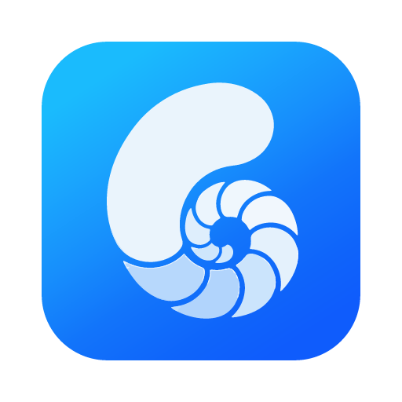

<p align="center">
  
</p>

<h1 align="center">apicase</h1>

**API 接口调试、管理与用例编排** 的本地优先（local-first）桌面软件。

一句话：**用文件组织的、可编排的 API 用例集**。打开一个目录即一个工作空间，folder 即分组，`.yml` 即用例；单个 API 调试与多步编排在同一套模型下统一。

> 状态：**v0.1 · MVP**。已可打开工作空间、可视化编辑与执行单 / 多节点用例。

## 设计理念

- **文件即数据（local-first）** —— case 不进数据库，就是磁盘上的 `.yml`。Git 友好、可 diff、可 review、可离线，数据完全由用户掌控。
- **单 / 多请求统一为 DAG** —— 不做两套模型：单请求 = 退化的单节点 DAG，多步编排 = 多节点 DAG（节点间以 `dependsOn` 声明依赖）。概念更少、代码路径统一、单 → 多平滑演进。
- **变量与数据流** —— 变量就近覆盖：environment（全局） < case 级 `vars` < 上游节点 `outputs`；透传语法 `${{baseUrl}}`、`${{steps.login.outputs.token}}`；输出按 JSONPath 从响应体提取供下游引用。
- **YAML 作为载体** —— case / 配置都用 YAML，可读、可注释、Git 友好；schema 参考 Postman / HAR / Insomnia / Bruno（request）与 Arazzo / GitHub Actions（flow）。

## 功能特性

- **单 API 调试** —— Postman 风格请求行（方法 + URL + 发送），参数 / 请求头 / 认证 / 请求体四 Tab；响应区展示状态码 / 耗时 / 大小 / 响应头 / 响应体（Pretty / Raw）。请求由 Rust 后端（`reqwest`）发出，**天然绕过浏览器 CORS**。
- **工作空间与文件树** —— 打开 / 创建目录为工作空间（幂等写 `application.yml`）；懒加载文件树，支持搜索、右键新建 / 重命名 / 删除，可视化对话框新建 case。
- **flow 编排（DAG 画布）** —— `dependsOn` 自动分层布局 + SVG 连线；两级视图切换（**文本 | 可视**，可视再分 **流程 / 请求**）；内容驱动默认视图。
- **执行引擎** —— 拓扑序串行运行，步骤间**变量透传** + **输出提取**（JSONPath 常用子集）+ **断言**（`eq/ne/contains/exists/notExists/gt/lt/matches`，逐条 ✓/✗，失败标红节点）。
- **多环境** —— `application.yml` 的 `environment` 段多套环境切换，运行时注入变量；仿 GitHub 风格的可视化设置页。
- **多标签页** —— 同时打开多个 case，标签切换 / dirty 标记 / 中键关闭 / 右键批量关闭，非活动标签完整保留编辑态。
- **原生桌面体验** —— macOS 自定义标题栏；任意文本 / 二进制文件可打开（二进制由 Rust 端嗅探并友好提示）。
- **命令行** —— `apicase run` 无界面跑用例并落 HTML 报告（与界面**同一个执行内核**，结果不会两样）；
  退出码区分「断言失败」与「请求发不出去」，接 CI 直接可用。
- **MCP 服务器** —— `apicase mcp` 让 AI Agent 直接查格式、写用例、自检、运行、读失败现场。

## 技术栈

| 层 | 选型 |
|---|---|
| 桌面框架 | Tauri 2（Cargo workspace：`core/` + `src-tauri/` + `cli/`） |
| 执行内核 | **`apicase-core`**（零 GUI 依赖）：`reqwest` + rustls、`cookie_store`、`tokio`、`serde_yaml` |
| 命令行 / MCP | **`apicase-cli`**（零 GUI 依赖）：`clap`、`rmcp`（MCP 官方 Rust SDK） |
| 前端 | React 19 + TypeScript + Vite 7（**只做配置与展示**，无 YAML / HTTP 依赖） |
| 存储格式 | YAML（case / 配置；格式参考 Postman / HAR / Arazzo 等） |

## 快速使用

**环境要求**：Node.js（含 npm）、Rust 工具链（`cargo` / `rustc`）；Tauri 系统依赖（macOS 自带 WebKit，Windows 需 WebView2，Linux 需 WebKitGTK）。

```bash
cd app
npm install               # 首次安装前端依赖

# 图形界面
npm run tauri dev         # 启动桌面应用（热重载）
npm run tauri build       # 打包各平台安装包

# 命令行（只编 cli 与 core，不碰 Tauri，增量编译约 2 秒）
cargo cli run -e dev      # == cargo run -q -p apicase-cli -- run -e dev
cargo build -p apicase-cli --release   # 出正式二进制
```

自测：

```bash
npm run build             # 前端类型检查 + 打包
npm test                  # 前端单测 + IPC 接线核对
cargo test --workspace    # 执行内核 + 命令层 + CLI（默认全部离线）
```

启动后：左上角「选择工作空间」打开一个目录 → 在文件树新建 / 打开 `.yml` → 编辑请求并「发送」，多节点用例点「▶ 运行」按拓扑序执行。

### 命令行

命令行与界面是**两个各自独立的可执行文件**，共享同一个执行内核，也共用工作空间配置、
cookie 会话与报告目录：

| 产物 | 包名 | 构建 |
|---|---|---|
| `apicase` | `apicase-cli` | `cargo build -p apicase-cli --release` |
| `Apicase.app` / `.dmg` | `apicase-desktop` | `npm run tauri build` |

三个包名对齐为 `apicase-core` / `apicase-cli` / `apicase-desktop`；产物名与包名不必相同——
CLI 的产物叫 `apicase`，因为用户敲的是 `apicase run`。

> 桌面端**要用 `npm run tauri build`**，不能用 `cargo build -p apicase-desktop --release` 代替：
> 后者只编 Rust，既不会先构建前端（于是嵌进去的是 `dist/` 里的旧版本，且不给任何提示），
> 也不产出 `.app` / `.dmg`。`cargo build -p apicase-desktop` 只适合「验证 Rust 侧能不能编过」。

拆成两个而不是一个按参数分流，是因为带 GUI 的二进制在没装桌面环境的机器上
连动态链接都过不去——那时 `apicase run` 一行代码都执行不到。
两者互不引用，可以单独分发、单独安装、单独升级。

```bash
cargo build -p apicase-cli --release        # 产出 target/release/apicase

apicase init                                # 把当前目录初始化为工作空间
apicase new 登录 -X POST --url https://api.example.com/login
apicase check                               # 只解析不发请求，查出依赖断裂 / 断言目标写错等
apicase run                                 # 跑整个工作空间，落一份 HTML 报告
apicase run api/login.yml -e prod           # 跑一个用例，用 prod 环境
apicase run flow.yml --step createOrder     # 只跑这个请求（上游依赖自动带上）
apicase run --json | jq .summary            # 管道里自动给 JSON
apicase docs assertions                     # 查用例 YAML 的格式规范
```

工作空间**向上查找** `application.yml`（同 git 找 `.git`），在任何子目录里敲都能工作。

**退出码**：`0` 全部通过 · `1` 断言失败（被测服务的问题）· `2` 用法 / 配置错误 · `3` 请求发不出去（环境或用例自身的问题）。
`1` 与 `3` 分开，是因为这两者的排查方向完全不同。

### MCP（给 AI Agent 用）

```json
{ "mcpServers": { "apicase": { "command": "apicase", "args": ["mcp", "-w", "/path/to/workspace"] } } }
```

七个工具：`apicase_run` / `check` / `list` / `show` / `env` / `report` / `docs`。
用例是 YAML 文本，AI 用自带的文件工具直接编辑即可，故不提供写入工具。
典型闭环：**`docs` 查格式 → 写 `.yml` → `check` 自检 → `run` 验证 → 读失败现场再改**。

## 配置与格式

> 以下为要点与示例，完整字段规范见 [docs/0.latest/3.YAML格式规范.md](docs/0.latest/3.YAML格式规范.md)。

### application.yml（工作空间配置）

工作空间根目录的配置文件，定义多套环境（每套一组变量），topbar 右侧下拉切换活动环境，运行时注入：

```yaml
environment:
  dev:  { baseUrl: https://dev.example.com,  token: "" }
  test: { baseUrl: https://test.example.com, token: "" }
  prod: { baseUrl: https://api.example.com,  token: "" }
```

### case.yml（用例）

一个 `.yml` 即一个 case，模型上是 DAG；写盘时恒定使用 `requests:` 列表（单节点也是长度为 1 的列表）。

**顶层字段**：`apicase`（版本，必填）· `name`（可选）· `vars`（case 级变量，可选）· `requests`（请求节点列表，必填）· `ui.nodes`（画布坐标，可选）。

**请求节点**（顺序 `id → dependsOn → http → outputs → assertions`）：`id` 唯一标识 · `dependsOn` 上游依赖 · `http` 报文（`method/url/query/headers/auth/body`）· `outputs` 输出提取 · `assertions` 断言。

**单节点用例**（等价于「发一个 API」）：

```yaml
apicase: v0.1
name: 获取用户
vars:
  baseUrl: https://api.example.com
requests:
  - id: getUser
    http:
      method: GET
      url: ${{baseUrl}}/users/1
    assertions:
      - { target: status, op: eq, value: "200" }
      - { target: $.data.id, op: exists }
```

**多节点用例**（登录 → 下单，`dependsOn` 声明依赖、`outputs` 提取变量供下游透传）：

```yaml
apicase: v0.1
name: 登录并下单
vars:
  baseUrl: https://api.example.com
requests:
  - id: login
    http:
      method: POST
      url: ${{baseUrl}}/login
      body:
        type: json
        json: { username: admin, password: "123456" }
    outputs:
      - { name: token, path: $.data.token }
    assertions:
      - { target: status, op: eq, value: "200" }
  - id: createOrder
    dependsOn: [login]
    http:
      method: POST
      url: ${{baseUrl}}/orders
      headers:
        - { name: Authorization, value: Bearer ${{steps.login.outputs.token}} }
      body:
        type: json
        json: { sku: A-1001, qty: 2 }
    assertions:
      - { target: $.code, op: eq, value: "0" }
```

- **auth 类型**：`none` / `bearer` `{ token }` / `basic` `{ username, password }` / `apikey` `{ key, value, in: header|query }`。
- **body 类型**：`none` / `json` / `text`（可选 `contentType`）/ `form-urlencoded` / `form-data`。
- **断言目标**：`status` / `header.<名>` / JSONPath（如 `$.code`）。
- **变量**：`${{name}}`；跨节点引用上游输出用 `${{steps.<请求id>.outputs.<输出名>}}`；未解析保留字面量。

## 仓库结构

```
apicase/
├── app/             # 应用代码（Cargo workspace + 前端）
│   ├── core/        # apicase-core：执行内核（桌面壳与 CLI 共用）
│   ├── src-tauri/   # 桌面壳：Tauri 命令层
│   ├── cli/         # apicase-cli：命令行与 MCP 服务器
│   └── src/         # 前端：只做配置与展示
├── docs/
│   ├── 0.latest/    # 当前全局最新文档 —— 唯一事实来源
│   └── 1.feature/   # 各需求的产品技术方案（YYYYMMDD-需求名）
└── CLAUDE.md        # 全局提示词
```

## 文档

`docs/0.latest/` 是项目的**唯一事实来源**，涉及现状的判断以此为准：

- [0.概览](docs/0.latest/0.概览.md) —— 定位、当前能力、技术栈、路线。
- [1.产品概念模型](docs/0.latest/1.产品概念模型.md) —— 文件即数据、folder / case、关键设计决策。
- [2.技术架构](docs/0.latest/2.技术架构.md) —— 目录结构、后端命令与数据模型、运行与构建。
- [3.YAML格式规范](docs/0.latest/3.YAML格式规范.md) —— case / application.yml 的完整字段格式与序列化约定。

## 路线（下一步）

1. 未定义变量高亮（`${{var}}` 找不到时提示）；深色主题。
2. JSONPath 通配符 / 过滤器、flow 并发执行、断言更多目标（响应耗时 / 大小）。
3. 画布节点拖拽持久化、标签拖拽排序、最近列表持久化、文件树外部变更自动刷新、历史、导入导出（Postman / Arazzo）、OpenAPI(SPEC)。
